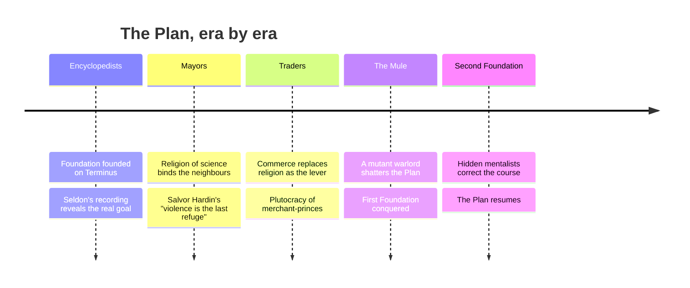
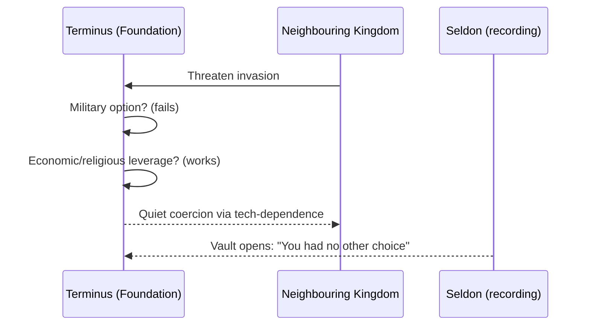

# Foundation & the Seldon Plan

As the Galactic Empire decays, mathematician **Hari Seldon** predicts a 30,000-year dark
age. He cannot stop the fall, but psychohistory lets him *shorten* it to a single millennium
by establishing the **Foundation** at the galaxy's edge.

## The Seldon Crises

The Plan advances through a series of inevitable **crises**, each one resolvable only along a
single path — narrowing the Foundation's choices until the "right" future is forced.

:::note[Hardin's razor]
Salvor Hardin's maxim runs through the early books: *"Never let your sense of morals prevent
you from doing what is right."* — and its companion, *"Violence is the last refuge of the
incompetent."*
:::

## A crisis, as a decision

!!! success "Why it works"
    Each crisis has exactly one viable solution given the forces in play. The Foundation
    doesn't *choose* its path so much as **discover** the only door that isn't locked.

---

Back to [Asimov](./) · [library home](../../).
