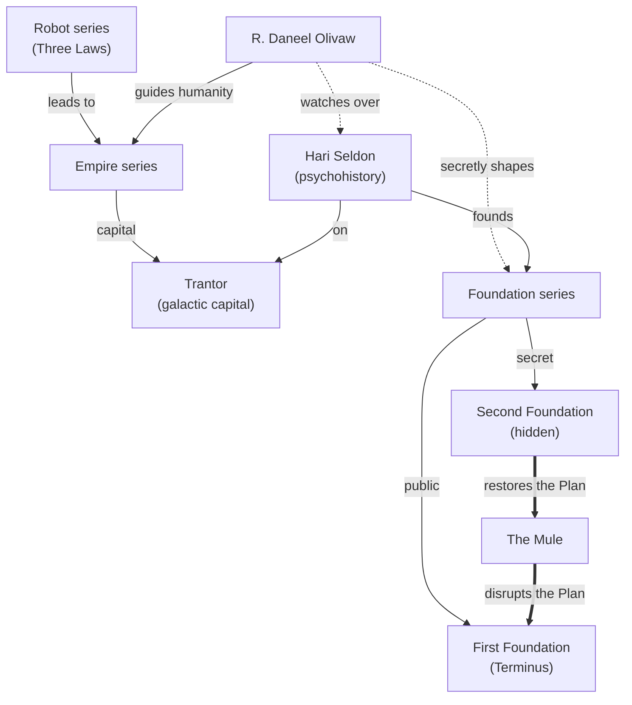

# Isaac Asimov

Over decades, Isaac Asimov wove his **Robot**, **Empire**, and **Foundation** stories into a
single future history spanning twenty thousand years — from the first positronic robots to
the slow fall and rebirth of a Galactic Empire.

:::tip
New here? Start with the **Robot** short stories for the *Three Laws*, then jump to
[Foundation](foundation) for psychohistory and the Seldon Plan.
:::

## How the universe connects



## The Three Laws of Robotics

The bedrock of every Robot story — and the source of nearly every plot, because the Laws
*conflict*:

```text
1. A robot may not injure a human being or, through inaction,
   allow a human being to come to harm.
2. A robot must obey the orders given it by human beings, except
   where such orders would conflict with the First Law.
3. A robot must protect its own existence as long as such protection
   does not conflict with the First or Second Law.
```

Later, R. Daneel formulates the overriding **Zeroth Law**:

!!! warning "The Zeroth Law"
    *A robot may not harm **humanity**, or, by inaction, allow humanity to come to harm.*
    This lets a robot sacrifice an individual for the species — a profound and dangerous shift.

A toy evaluation of the Laws in priority order:

```csharp
public enum Law { Zeroth, First, Second, Third }

public bool IsActionPermitted(Action a) =>
    !a.HarmsHumanity()         // Zeroth
    && !a.HarmsHuman()         // First
    && (a.IsOrdered() || a.SelfPreserving()); // Second / Third
```

## Psychohistory in one paragraph

Hari Seldon's mathematics treats the galaxy's quintillions of people as a gas: individuals
are unpredictable, but the *aggregate* follows statistical law — **so long as the population
is large and unaware of the predictions**. The Mule breaks the model precisely because he is
a singular, unpredictable mutant.

??? note "The Foundation's secret"
    There are **two** Foundations. The First, on Terminus, openly preserves science and
    technology. The **Second Foundation** — hidden, made of mentalic "psychologists" — quietly
    keeps the Seldon Plan on course and, ultimately, hands the future to Daneel's long design.

---

Read on: [Foundation & the Seldon Plan](foundation) · back to the [library home](../).
