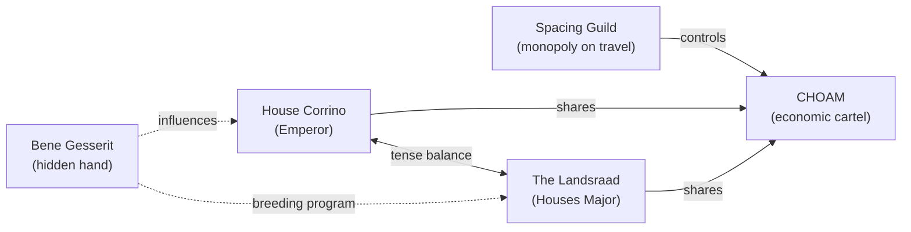

# Great Houses of the Landsraad

The **Landsraad** is the assembly of the noble Houses Major, a political counterweight to
the Imperial House Corrino. Power rests on a three-way balance between the **Emperor**, the
**Landsraad**, and the **Spacing Guild** — with the Bene Gesserit pulling threads behind all
three.

## Houses Major

| House | Homeworld | Sigil | Notes |
|---|---|---|---|
| Corrino | Kaitain | Golden Lion | Holds the throne; commands the Sardaukar |
| Atreides | Caladan | Red Hawk | Honour-bound; beloved leadership |
| Harkonnen | Giedi Prime | Blue Griffin | Wealth through cruelty and the spice |
| Vernius | Ix | — | Masters of forbidden machine tech |
| Richese | Richese | — | Declining industrial House |

## Balance of power

:::note
**CHOAM** (the Combine Honnete Ober Advancer Mercantiles) is the universal development
corporation. Directorships are the real currency of Imperial politics — far more than land.
:::

## Kanly

A formal vendetta between Houses, conducted under strict rules of the **Great Convention**.
The one inviolable law:

> *"The forms must be obeyed."* — and above all, **no atomics against humans**, on pain of
> planetary annihilation by the combined Houses.

---

Back to [Dune](./), or to the [library home](../../).
