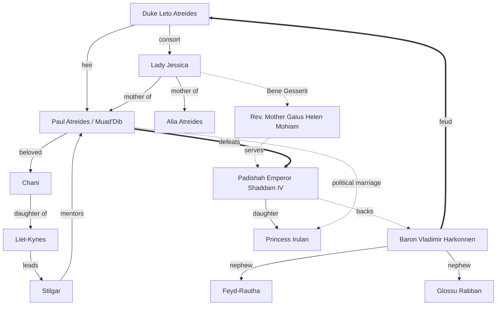

# Dune

Frank Herbert's **Dune** (1965) and its sequels chronicle the desert planet **Arrakis** —
the only source of the spice **melange** — and the rise of **Paul Atreides** from exiled
heir to messianic emperor. It's a story about ecology, religion, politics, and the price
of prescience.

:::warning[Spoilers ahead]
The character map and the *House Atreides* section below reveal major relationships and
plot turns from the first novel. The collapsible section at the bottom goes further.
:::

## Main characters & relations



## The great Houses

A quick reference — the full ledger lives on the [Great Houses](houses) page.

| House | Seat | Allegiance |
|---|---|---|
| Atreides | Caladan → Arrakis | Protagonists |
| Harkonnen | Giedi Prime | Antagonists |
| Corrino | Kaitain | Imperial throne |
| Fremen (Sietch) | Arrakis | Native power |

!!! info "The spice must flow"
    Melange extends life, expands consciousness, and is **required** for Guild Navigators
    to fold space. Whoever controls Arrakis controls the spice — and whoever controls the
    spice controls the Imperium.

## The Litany Against Fear

The Bene Gesserit mantra, as Paul recites it during the gom jabbar trial:

```text
I must not fear.
Fear is the mind-killer.
Fear is the little-death that brings total obliteration.
I will face my fear.
I will permit it to pass over me and through me.
And when it has gone past, I will turn the inner eye to see its path.
Where the fear has gone there will be nothing. Only I will remain.
```

A (very) simplified model of the spice economy:

```python
def guild_can_navigate(spice_reserves_kg: float) -> bool:
    """Navigators need melange to plot safe paths through foldspace."""
    MIN_DOSE = 1_000.0
    return spice_reserves_kg >= MIN_DOSE

assert guild_can_navigate(5_000) is True
```

??? danger "Ending — full spoilers"
    Paul drinks the Water of Life, awakens as the **Kwisatz Haderach**, leads the Fremen
    to overthrow House Harkonnen and Emperor Shaddam IV, and takes the throne by threatening
    to destroy all spice. His ascension triggers a galaxy-spanning **jihad** in his name —
    the very future he foresaw and could not prevent.

---

Continue to the [Great Houses of the Landsraad](houses), or head back to the
[library home](../).
