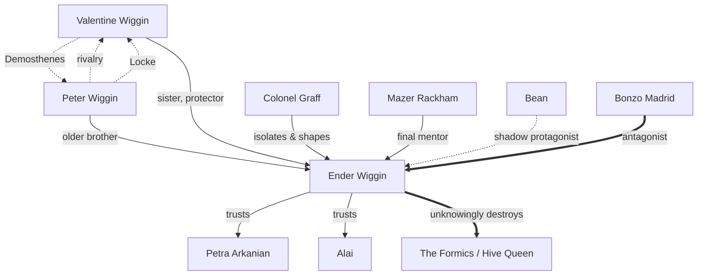

# Ender's Game

Orson Scott Card's **Ender's Game** (1985) follows **Andrew "Ender" Wiggin**, a gifted child
conscripted into Battle School to be trained — and manipulated — into the commander humanity
needs against the alien **Formics** ("Buggers").

:::warning[Spoilers]
The character map and the collapsible ending below give away the novel's central twist.
:::

## Main characters & relations



## Battle School

| Army | Leader | Note |
|---|---|---|
| Salamander | Bonzo Madrid | Benches Ender out of spite |
| Rat | Rose de Nose | Ender's second posting |
| Dragon | **Ender Wiggin** | Re-formed army of rejects and rookies |

!!! info "The null-gravity battleroom"
    Ender's tactical insight is orientation itself: *"The enemy's gate is down."* Reframing
    the battleroom turns a chaotic free-fall into a problem with a clear attack vector.

## Locke & Demosthenes

While Ender is in orbit, his siblings quietly seize Earth's political future under
pseudonyms — Peter as the moderate **Locke**, Valentine as the firebrand **Demosthenes**:

```json
{
  "personas": [
    { "author": "Peter",     "alias": "Locke",       "tone": "statesmanlike" },
    { "author": "Valentine", "alias": "Demosthenes", "tone": "incendiary" }
  ],
  "goal": "shape public opinion via the nets"
}
```

??? danger "The twist — full spoilers"
    Ender believes his final exam is a **simulation** against Mazer Rackham. It is real: every
    "game" was a live battle, and his climactic move — the Little Doctor on the Formic
    homeworld — commits **xenocide**. The adults hid the truth so his empathy wouldn't stay his
    hand. He spends the sequels, beginning with *Speaker for the Dead*, atoning.

---

Back to the [library home](../).
